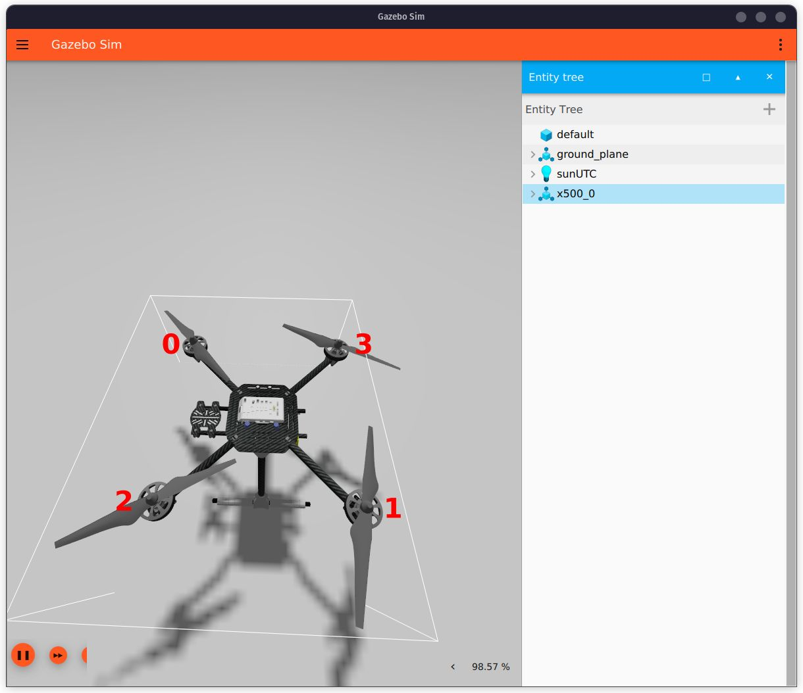
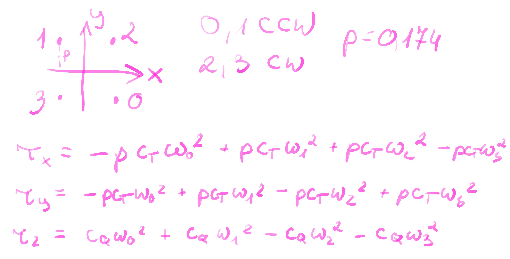

# Some notes

Just some notes to make sense of what was done.

## Motor order

When sending `ActuatorMotors` message, the order of rotors is pictured below.



## Getting coefficients and other data from models

Let's consider the following equations for moments on every axis:



Written in matrix form (eq. 8 in the script). In the code signs in third row $\tau_y$ are inverted, don't know why:

$$ \begin{bmatrix}
T \\
\tau_x \\
\tau_y \\
\tau_z 
\end{bmatrix} = \begin{bmatrix}
c_T & c_T & c_T & c_T \\
-pc_T & pc_T & pc_T & -pc_T \\
-pc_T & pc_T & -pc_T & pc_T \\
c_Q & c_Q & -c_Q & -c_Q 
\end{bmatrix}
\begin{bmatrix}
{\omega_0}^2 \\
{\omega_1}^2 \\
{\omega_2}^2 \\
{\omega_3}^2 
\end{bmatrix} $$

We can read the necessary $p$ (distance from axis, arm length times $\sqrt{2}$), $c_T$ (thrust constant) and $c_Q$ (rotor drag coefficient) from models in official repos. In [x500/model.sdf](https://github.com/PX4/PX4-gazebo-models/blob/main/models/x500/model.sdf) we can find $c_T$ and $c_Q$:

```xml
...
    <plugin filename="gz-sim-multicopter-motor-model-system" name="gz::sim::systems::MulticopterMotorModel">
      <jointName>rotor_0_joint</jointName>
      <linkName>rotor_0</linkName>
      <turningDirection>ccw</turningDirection>
      <timeConstantUp>0.0125</timeConstantUp>
      <timeConstantDown>0.025</timeConstantDown>
      <maxRotVelocity>1000.0</maxRotVelocity>
      <motorConstant>8.54858e-06</motorConstant> <!-- possibly c_T -->
      <momentConstant>0.016</momentConstant>
      <commandSubTopic>command/motor_speed</commandSubTopic>
      <motorNumber>0</motorNumber>
      <rotorDragCoefficient>8.06428e-05</rotorDragCoefficient> <!-- possibly c_Q -->
      <rollingMomentCoefficient>1e-06</rollingMomentCoefficient>
      <rotorVelocitySlowdownSim>10</rotorVelocitySlowdownSim>
      <motorType>velocity</motorType>
    </plugin>
...
```

In [x500_base/model.sdf](https://github.com/PX4/PX4-gazebo-models/blob/main/models/x500_base/model.sdf) we can find the pose of any rotor link, for example `rotor_0` and other model data like mass and inertia:

```xml
...
    <link name="base_link"> <!-- may be important later -->
      <inertial>
        <mass>2.0</mass>
        <inertia>
          <ixx>0.02166666666666667</ixx>
          <ixy>0</ixy>
          <ixz>0</ixz>
          <iyy>0.02166666666666667</iyy>
          <iyz>0</iyz>
          <izz>0.04000000000000001</izz>
        </inertia>
      </inertial>
...
    <link name="rotor_0">
      <gravity>true</gravity>
      <self_collide>false</self_collide>
      <velocity_decay/>
      <pose>0.174 -0.174 0.06 0 0 0</pose> <!-- pose of rotor 0 -->
...
```

From the pose tag we can take the distance $p = 0.174 \ \text{m} = 17.4 \ \text{cm}$.

## Converting quaternions to RPY

The script `attitude_to_rpy.py` is an example that converts quaternion data published on `/fmu/out/vehicle_attitude` topic to roll, pitch and yaw angles and prints them to terminal. The conversion is done using `scipy.spatial.transform.Rotation`.

## ActuatorMotors message

The rotors spin in the direction defined in [x500/model.sdf](https://github.com/PX4/PX4-gazebo-models/blob/main/models/x500/model.sdf), tag `turningDirection` when supplied with positive PWM values. It should be taken into account when calculating PWM (the rotational speed in the equations may be negative to account for anitclockwise rotation).

## Frame conventions

As stated in [PX4 Guide](https://docs.px4.io/v1.15/en/ros2/user_guide.html#ros-2-px4-frame-conventions), ROS2 and PX4 use different frame conventions, which means that some vectors may need to be rotated. It could be usefull to remember while declaring a setpoint.

We also know from [VehicleAttitude page](https://docs.px4.io/v1.15/en/msg_docs/VehicleAttitude.html#vehicleattitude-uorb-message) that in PX4 quaternion has the order `q(w, x, y, z)` and that should be taken into account when doing any kind of conversion to RPY angles.

## Trajectory planning

Useful python implementation: [toppra](https://github.com/hungpham2511/toppra).